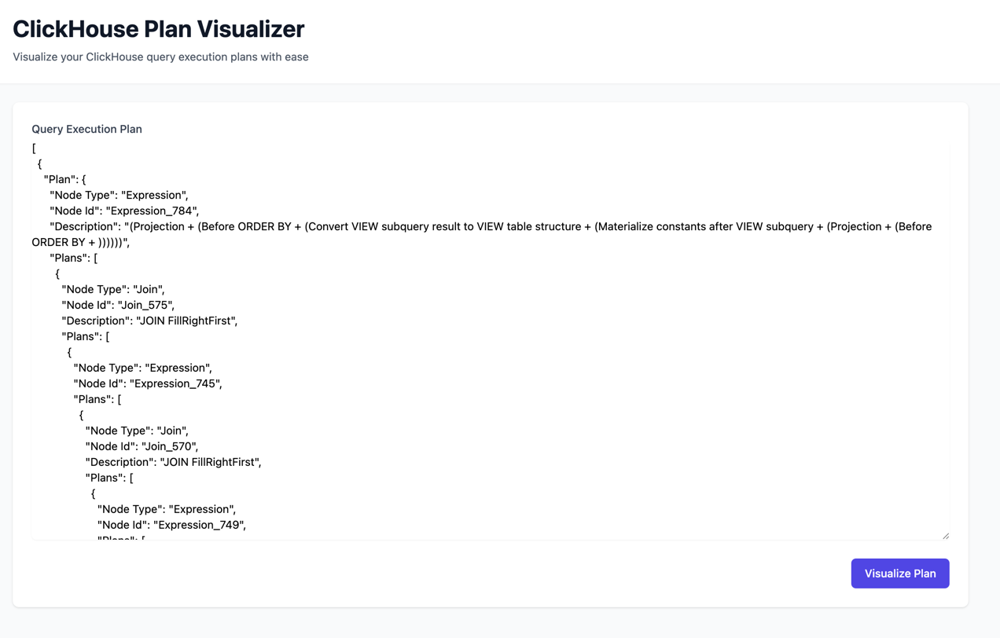
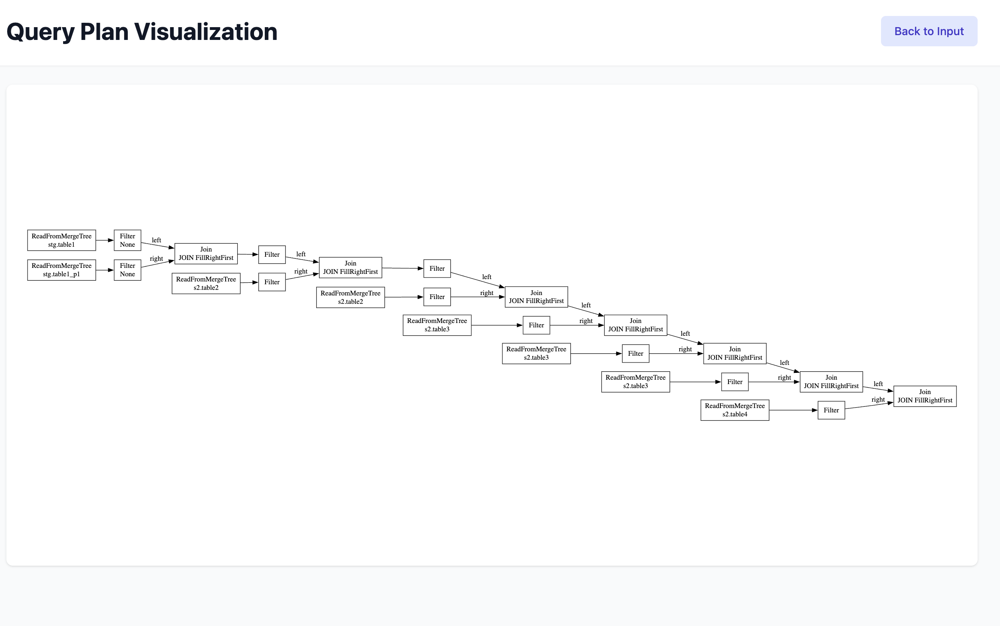

# ClickHouse Plan Visualizer

A web service that visualizes ClickHouse query execution plans using Graphviz.

## Features

- Visualize ClickHouse EXPLAIN output as directed graphs

## Requirements

- Python 3.9 or higher
- Graphviz (system dependency)

## Installation

1. Clone the repository:
```bash
git clone https://github.com/yourusername/clickhouse-plan-visualizer.git
cd clickhouse-plan-visualizer
```

2. Create and activate a virtual environment:
```bash
python -m venv .venv
source .venv/bin/activate  # On Windows, use `.venv\Scripts\activate`
```

3. Install dependencies:
```bash
pip install -e .
```

## Running with Docker Compose

1. Build and start the service:
```bash
docker compose up --build
```

2. Open your web browser and navigate to `http://localhost:8000`

To stop the service, press `Ctrl+C` in the terminal or run:
```bash
docker compose down
```

## Usage

1. Start the web service:
```bash
fastapi dev src/main.py
```

2. Open your web browser and navigate to `http://localhost:8000`



3. Submit your ClickHouse EXPLAIN output in the web interface to visualize the query plan

